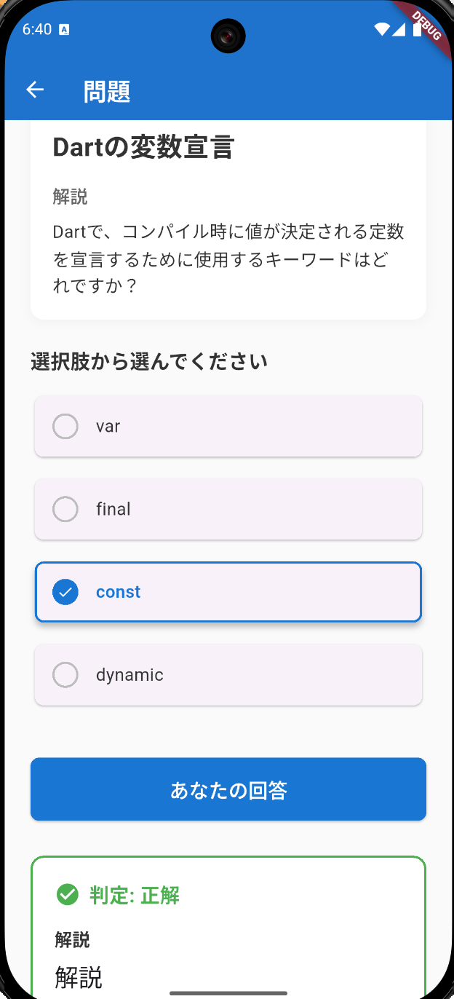

# Flutter e-Learning アプリ

Flutterで開発した学習アプリです。プログラミング学習に特化した問題出題システムを提供します。

## 機能

### 基本機能
- **問題出題**: 選択式・コード入力式の問題を出題
- **履歴管理**: 学習履歴の表示・管理
- **セクション管理**: 学習内容をセクション単位で管理
- **設定画面**: アプリの各種設定
- **多言語対応**: 日本語・英語に対応した国際化機能

### 技術的特徴
- **状態管理**: Riverpod を使用したリアクティブな状態管理
- **ナビゲーション**: GoRouter による宣言的ルーティング
- **コードエディタ**: flutter_code_editor による本格的なコード編集機能
- **外部API連携**: Dify APIと連携したAI機能（フィードバック生成等）
- **国際化**: slang パッケージによる型安全な多言語対応
- **クリーンアーキテクチャ**: レイヤー分離による保守性の高い設計

## 画面一覧

| **ホーム画面** | **セクション一覧画面** | **問題画面（選択式）** | **問題画面（コード入力）** | **履歴詳細画面** | **設定画面**  |
|:---:|:---:|:---:|:---:|:---:|:---:|
|  |  |  |  |  |  |


アプリケーションは以下の画面で構成されています：

### メイン画面
- **ホーム画面** (`HomeScreen`): アプリのメイン画面。学習状況の概要とナビゲーション
- **セクション一覧画面** (`SectionListScreen`): 学習セクションの一覧表示と選択
- **セクション画面** (`SectionScreen`): 選択したセクションの詳細と問題一覧

### 学習関連画面
- **問題画面** (`QuestionScreen`): 選択式・コード入力式の問題出題画面
  - 選択式問題: 複数選択肢から回答を選択
  - コード入力式問題: `flutter_code_editor`によるコード編集・実行

### 履歴・記録画面
- **履歴一覧画面** (`HistoryListScreen`): 学習履歴の一覧表示
- **履歴詳細画面** (`HistoryScreen`): 個別の学習履歴の詳細表示

### 設定画面
- **設定画面** (`SettingScreen`): アプリケーションの各種設定

### 画面遷移フロー
- ホーム画面→セクション一覧画面→セクション画面→問題画面
- ホーム画面→設定画面
- ホーム画面→学習履歴一覧画面→学習履歴画面
## 技術スタック

### フロントエンド
- **Flutter 3.8+**: モバイルアプリケーションフレームワーク
- **Dart**: プログラミング言語

### 状態管理・アーキテクチャ
- **Riverpod (flutter_riverpod: ^2.6.1)**: 状態管理
- **hooks_riverpod**: React Hooksスタイルの状態管理
- **riverpod_generator & riverpod_annotation**: コード生成による型安全性

### ナビゲーション
- **go_router (^15.1.2)**: 宣言的ルーティング

### UI・ユーザー体験
- **flutter_code_editor (^0.3.3)**: コードエディタ機能
- **flutter_highlight (^0.7.0)**: シンタックスハイライト
- **flutter_markdown (^0.7.7+1)**: Markdown表示
- **file_picker (^10.1.9)**: ファイル選択機能

### 国際化（i18n）
- **slang (^4.7.3)**: 型安全な多言語対応
- **slang_flutter (^4.7.0)**: Flutter用slang拡張
- **slang_build_runner (^4.7.0)**: 自動コード生成
- **flutter_localizations**: Flutter標準の国際化サポート

### データ管理
- **sqflite (^2.4.2)**: ローカルデータベース（SQLite）
- **path (^1.9.1)**: ファイルパス操作

### ネットワーク・API
- **dio (^5.8.0+1)**: HTTP クライアント
- **retrofit (^4.4.2)**: タイプセーフなHTTP API クライアント
- **retrofit_generator (^9.2.0)**: retrofit用コード生成

### コード生成・開発支援
- **build_runner (^2.5.4)**: コード生成ツール
- **freezed (^3.0.6)**: イミュータブルクラス生成
- **json_serializable (^6.9.5)**: JSON シリアライゼーション
- **source_gen (^2.0.0)**: コード生成基盤

### ユーティリティ
- **package_info_plus (^8.3.0)**: アプリ情報取得
- **flutter_hooks (^0.21.2)**: React Hooksスタイルのライフサイクル管理

## アーキテクチャ

このアプリケーションはMVVM + Clean Architecture + DDDを採用し、レイヤー分離による保守性の高い設計となっています。

### layers
- presantation layer (path: lib/presantation)
画面や画面の状態が配置される場所です。MVVMでViewとViewModelがあります。
- usecase layer (path: lib/usecase)
ViewModelから呼び出されるユースケースを配置する場所です。
- domain layer (path: lib/domain)
ビジネスロジックや業務知識を表示するentityやvalue_objectが配置されている場所です。
- infrastructure layer (path: lib/infrastructure)
DBやAPIクライアントのクラスが配置される場所です。

### 依存方向
presantation layer → usecase layer → domain layer ← infrastructure layer

### ディレクトリ構成

以下のlayerで構成されています。


```
lib/
├── common/          # 共通ユーティリティ（定数、ルーティング、DIプロバイダー）
├── domain/          # ドメイン層（ビジネスロジック、エンティティ）
├── generated/       # 自動生成ファイル（slang、riverpod等）
├── i18n/           # 国際化リソース（日本語・英語）
│   ├── en/         # 英語翻訳ファイル
│   └── ja/         # 日本語翻訳ファイル
├── infrastructure/ # インフラストラクチャ層（データソース、API）
├── presantation/   # プレゼンテーション層（UI、状態管理）
└── usecase/        # ユースケース層（アプリケーションロジック）
```

### アーキテクチャの詳細

詳細なアーキテクチャ情報については [`README_ARCHITECTURE.md`](./README_ARCHITECTURE.md) を参照してください。

## 開発セットアップ

### 前提条件
- Flutter SDK 3.8.0 以上
- Dart SDK

### セットアップ手順

1. **依存関係のインストール**
   ```bash
   flutter pub get
   ```

2. **コード生成の実行**
   ```bash
   flutter pub run build_runner build
   ```

3. **国際化ファイルの生成**
   ```bash
   # slangによる翻訳ファイルの自動生成
   flutter pub run slang build
   ```

4. **アプリの実行**
   ```bash
   flutter run
   ```

### 開発時の注意点

- **i18n（国際化）**: 新しい画面やテキストを追加する際は、`lib/i18n/ja/` と `lib/i18n/en/` の両方に翻訳を追加してください
- **コード生成**: データクラスやリポジトリの変更後は `flutter pub run build_runner build` を実行してください
- **状態管理**: Riverpodを使用しているため、プロバイダーの変更時はコード生成が必要です
