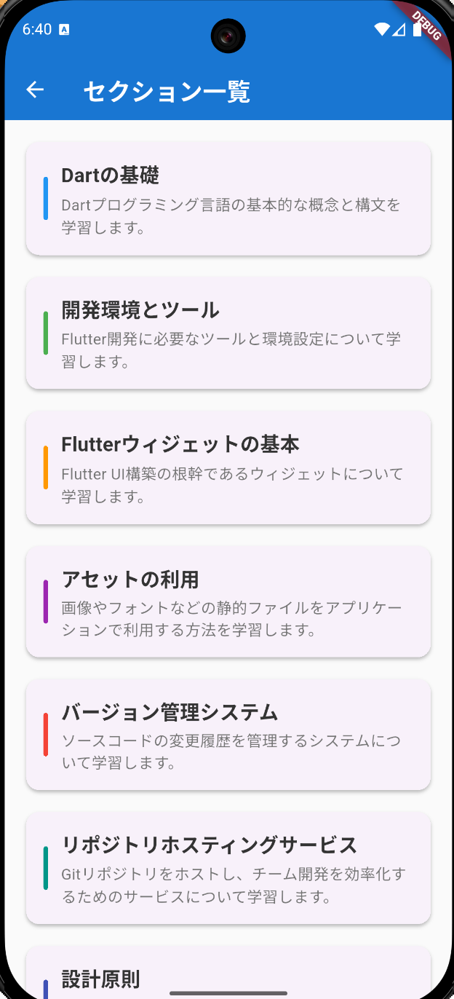

# Flutter e-Learning App

This is a Flutter-based e-learning application focused on programming practice. It provides a system for delivering both multiple-choice and code-input questions, with multilingual support and a clean architecture.

## Overview

- **Purpose:** Programming learning app with question delivery, history management, and section-based content.
- **Internationalization:** Supports Japanese and English (i18n via slang).
- **Architecture:** MVVM + Clean Architecture + DDD, with clear layer separation for maintainability.

## Features

- Multiple-choice and code-input questions
- Learning history management
- Section-based content organization
- Settings screen
- Multilingual support (Japanese/English)
- AI-powered feedback (Dify API integration)

## User Interface

| **Home** | **Section List** | **Question (Choice)** | **Question (Code Input)** | **History Detail** | **Settings** |
|:---:|:---:|:---:|:---:|:---:|:---:|
|  |  |  |  |  |  |

### **HomeScreen**
File: `lib/presantation/home/view/home_screen.dart`
Main dashboard, navigation entry point
### **SectionListScreen**
File: `lib/presantation/section_list/view/section_list_screen.dart`
List and select learning sections
### **SectionScreen**
File: `lib/presantation/section/view/section_screen.dart`
Details and questions for a selected section
### **QuestionScreen**
File: `lib/presantation/question/view/question_screen.dart`
Deliver questions (choice/code input)
  - Choice: Select from multiple options
  - Code Input: Edit and run code with `flutter_code_editor`
### **HistoryListScreen**
File: `lib/presantation/history_list/view/history_list_screen.dart`
List of learning history
### **HistoryScreen**
File: `lib/presantation/history/view/history_screen.dart`
Details of a specific learning record
### **SettingScreen**
File: `lib/presantation/setting/view/setting_screen.dart`
Application settings

### Screen Flow


The diagram above shows the main navigation flow of the app:
- From the Home screen, users can navigate to the Section List, Settings, or History List.
- From the Section List, users select a section to view its details.
- From a Section, users can access the Question screen to answer questions.
- From the History List, users can view details of a specific learning record in the History Detail screen.
- This structure provides intuitive access to all major features from the Home screen.

## Architecture

This app uses MVVM, Clean Architecture, and DDD principles for high maintainability.

### Layers


The diagram above illustrates the dependency direction between layers:
- The Presentation Layer depends on the Usecase Layer.
- The Usecase Layer depends on the Domain Layer.
- The Infrastructure Layer also depends on the Domain Layer and provides implementations for data access.
- The Domain Layer is independent and contains core business logic and entities.
This structure enforces separation of concerns and maintainability.

### Directory Structure

```
lib/
├── common/          # Common utilities (constants, routing, DI providers)
├── domain/          # Domain layer (business logic, entities)
├── generated/       # Auto-generated files (slang, riverpod, etc.)
├── i18n/            # i18n resources (ja/en)
│   ├── en/          # English translations
│   └── ja/          # Japanese translations
├── infrastructure/  # Infrastructure (data sources, APIs)
├── presantation/    # Presentation layer (UI, state management)
└── usecase/         # Usecase layer (application logic)
```

For more details, see [`README_ARCHITECTURE.md`](./README_ARCHITECTURE.md).

## Tech Stack

### Frontend
- **Flutter 3.8+**: Mobile app framework
- **Dart**: Programming language

### State Management & Architecture
- **Riverpod (flutter_riverpod: ^2.6.1)**: State management
- **hooks_riverpod**: React Hooks style state management
- **riverpod_generator & riverpod_annotation**: Type-safe code generation

### Navigation
- **go_router (^15.1.2)**: Declarative routing

### UI/UX
- **flutter_code_editor (^0.3.3)**: Code editor
- **flutter_highlight (^0.7.0)**: Syntax highlighting
- **flutter_markdown (^0.7.7+1)**: Markdown rendering
- **file_picker (^10.1.9)**: File picker

### Internationalization (i18n)
- **slang (^4.7.3)**: Type-safe i18n
- **slang_flutter (^4.7.0)**: Flutter integration for slang
- **slang_build_runner (^4.7.0)**: Code generation for i18n
- **flutter_localizations**: Flutter standard i18n support

### Data Management
- **sqflite (^2.4.2)**: Local database (SQLite)
- **path (^1.9.1)**: File path utilities

### Networking & API
- **dio (^5.8.0+1)**: HTTP client
- **retrofit (^4.4.2)**: Type-safe HTTP API client
- **retrofit_generator (^9.2.0)**: Code generation for retrofit

### Code Generation & Dev Tools
- **build_runner (^2.5.4)**: Code generation
- **freezed (^3.0.6)**: Immutable class generation
- **json_serializable (^6.9.5)**: JSON serialization
- **source_gen (^2.0.0)**: Code generation base

### Utilities
- **package_info_plus (^8.3.0)**: App info
- **flutter_hooks (^0.21.2)**: React Hooks style lifecycle

## Development Setup

### Prerequisites
- Flutter SDK 3.8.0 or higher
- Dart SDK

### Setup Steps

1. **Install dependencies**
   ```bash
   flutter pub get
   ```
2. **Run code generation**
   ```bash
   flutter pub run build_runner build
   ```
3. **Generate i18n files**
   ```bash
   flutter pub run slang build
   ```
4. **Run the app**
   ```bash
   flutter run
   ```

### Development Notes

- **i18n:** Add translations to both `lib/i18n/ja/` and `lib/i18n/en/` when adding new screens or text.
- **Code generation:** Run `flutter pub run build_runner build` after changing data classes or repositories.
- **State management:** Riverpod providers require code generation after changes.