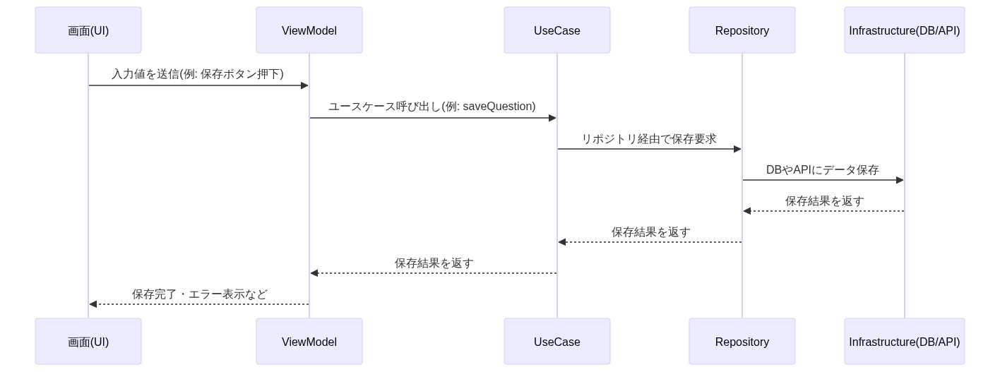

# Architecture

## Directory Structure
This project is structured with an architecture inspired by MVVM, Clean Architecture, and DDD (Domain-Driven Design).

### common
The `common` directory contains constants, routing, and DI providers that are used throughout the entire app.

### domain (Domain Layer)
The `domain` directory manages the application's business logic and domain models (data structures and processes with business meaning). Domain models are organized by context.

### generated
The `generated` directory contains auto-generated files. Do not edit these files directly.

### i18n
The `i18n` directory manages resource files for internationalization (i18n) and multilingual support.

### infrastructure (Infrastructure Layer)
The `infrastructure` directory contains code for the infrastructure layer, such as database and external API definitions. Repository implementations are also placed here.

### presantation (Presentation Layer)
The `presantation` directory manages the presentation (UI) layer of the application. It separates UI (View) and UI state (ViewModel) for better separation of concerns.

### usecase (Usecase Layer)
The `usecase` directory manages the usecase layer, which defines the application's specific operations and processing flows. Usecases are organized by context.

```
lib
 ├── common
 │   ├── constants
 │   ├── provider
 │   └── router
 ├── domain
 │   ├── dify
 │   ├── history
 │   ├── progress
 │   ├── question
 │   └── context
 ├── generated
 │   ├── common
 │   ├── domain
 │   ├── i18n
 │   ├── infrastructure
 │   └── presantation
 ├── i18n
 │   ├── en
 │   └── ja
 ├── infrastructure
 │   ├── data
 │   └── repository
 ├── presantation
 │   ├── history
 │   ├── history_list
 │   ├── home
 │   ├── question
 │   ├── section
 │   ├── section_list
 │   └── setting
 └── usecase
     ├── dify
     ├── history
     ├── progress
     ├── question
     └── setting
```

---

## Example Flow: From Screen Creation to Database Save



As shown above, the process flows in the order: UI → ViewModel → UseCase → Repository (Interface) → Repository (Implementation) → Infrastructure (DB), ensuring clear separation of responsibilities and dependency injection for repository implementations.


- The UseCase depends on a Repository Interface (abstract class).
- The actual Repository Implementation is injected (via DI) at runtime.
- The Repository Implementation handles the connection to the Infrastructure (DB).
- This pattern ensures testability, flexibility, and clear separation of concerns.

## Overall Directory Structure (Mermaid)


This diagram is generated from the actual directory and file structure under `lib/`, including subdirectories and key files. Each node represents a directory or file, providing a precise and up-to-date overview of the app's architecture.
